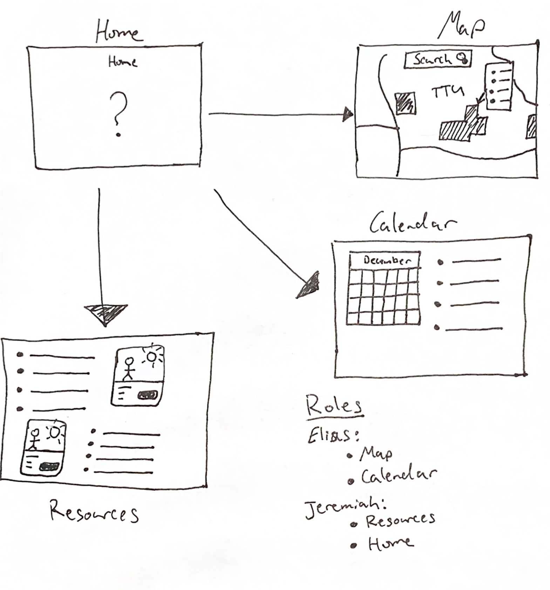

# Texas Tech Resource Guide

Group 18
: [Jeremiah Howden](https://github.com/JerHowden)
: [Elias Moreno](https://github.com/Eliascm17)

Links
: [Demo](https://jerhowden.github.io/TexasTechResourceGuide)

## User Feedback

Task
: The User will navigate the site and find the map location information quickly and easily.

Hypothesis
: The User will be able to find any building on campus under 20 seconds.

**Data**
|   Person |  Time   | Building  |
| -------: | ------- | :-------- |
| ________ | __ : __ | __________|
| ________ | __ : __ | __________|
| ________ | __ : __ | __________|
| ________ | __ : __ | __________|
| ________ | __ : __ | __________|
| ________ | __ : __ | __________|
| ________ | __ : __ | __________|

## Sketch

